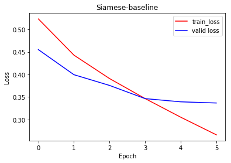
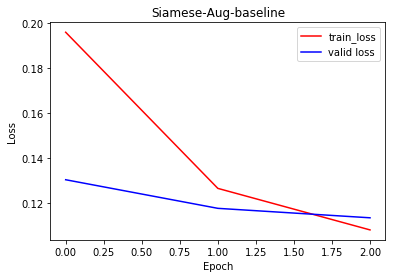
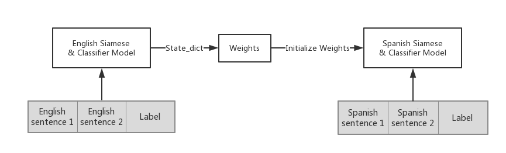
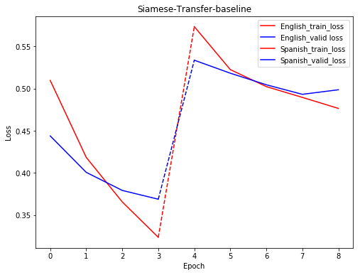
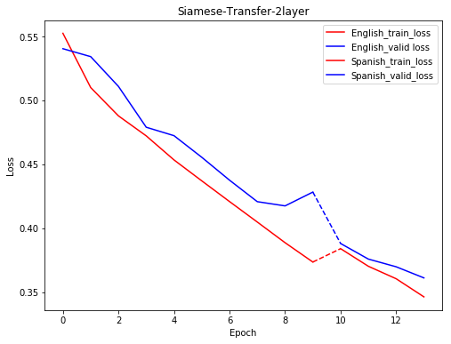
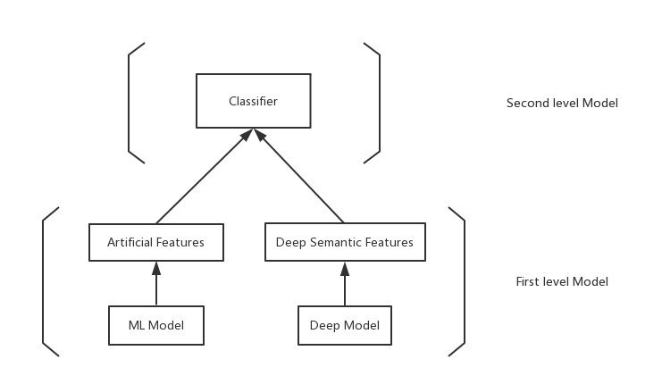

Table of Contents
=================

   * [Table of Contents](#table-of-contents)
   * [cikm 2018 - Sentence Similarity](#cikm-2018---sentence-similarity)
      * [Competition Introduction](#competition-introduction)
         * [Data Description](#test-data)
         * [Goal and Evaluation](#goal-and-evaluation)
      * [ML Model](#ml-model)
      * [Deep Model](#deep-model)
         * [Basic Model: LSTM-Siamese](#basic-model-lstm-siamese)
            * [Name Origin](#name-origin)
            * [Main Idea](#main-idea)
            * [Baseline](#baseline-configuration)
            * [Some Attempts](#training)
            * [Baseline result](#baseline-result)
         * [Data Augmentation](#data-augmentation)
            * [Main Idea](#main-idea-1)
            * [Problems](#problems)
            * [Augmentation result](#augmentation-result)
         * [Transfer Learning](#transfer-learning)
            * [Main Idea](#main-idea-2)
            * [Transfer result](#transfer-result)
      * [Result](#result)
      * [Ensemble](#ensemble)
      * [Implementation Details](#implementation-details)
         * [Basic Model](#basic-model)
         * [Data Augmentation](#data-augmentation-1)
         * [Transfer Learning](#transfer-learning-1)

# cikm 2018 - Sentence Similarity

AliMe is a chatbot for online shopping in a global context, this task is solving the short text matching problem with different language (Spanish & English)

Competition Website: <https://tianchi.aliyun.com/competition/introduction.htm?spm=5176.100150.711.6.600e2784M5Z0uW&raceId=231661>

## Competition Introduction

### Data Description

#### Training Data

21400 Labeled Spanish sentence pairs & English sentence pairs are provided;

55669 Unlabeled Spanish sentences & corresponding English translations are provided.

#### Test Data

5000 Spanish sentence pairs 

### Goal and Evaluation

Predicting the similarity of Spanish sentence pairs in test set.

Evaluated result by logloss.

## ML Model

Developed by [freedomwyl](https://github.com/freedomwyl) in [Link](https://github.com/freedomwyl/cikm2018)

## Deep Model

Common thoughts would be finding a way to represent sentences and calculate their similarity, with a little elaboration, here comes the basic model.

### Basic Model: LSTM-Siamese

#### Name Origin

The name comes from Siamese twins in Thailand, the conjoined twins whose body is partially shared with each other. Later the word "Siamese" refers to the phenomenon of twin structures, like this neural network.

#### Main Idea

This model takes in one sentence pair, encoding each sentence into vector representation through LSTM word by word (which gives the sentence embedding the information of word sequences). Then generate some vector features from them, feed into classifier to get the similarity.

#### Baseline

With standard parameter settings as follows, the validation loss can be 0.3463, which is a pretty well off-line score.

##### Baseline configuration

experiment_name: 'siamese-baseline'  

task: 'train'  
make_dict: False  
data_preprocessing: False  

ckpt_dir: 'ckpt/'  

training:  
    num_epochs: 20  
    learning_rate: 0.01
    #options = ['adam', 'adadelta', 'rmsprop']  
    optimizer: 'sgd'  

embedding:  
    full_embedding_path: 'input/wiki.es.vec'  
    cur_embedding_path: 'input/embedding.pkl'  

model:  
    fc_dim: 100  
    name: 'siamese'   
    embed_size: 300  
    batch_size: 1  
    embedding_freeze: False  
    encoder:  
        hidden_size: 150  
        num_layers: 1  
        bidirectional: False  
        dropout: 0.5  

result:  
    filename: 'result.txt'  
    filepath: 'res/'  

#### Some Attempts

##### Tuning Parameters

1. Classifier

   fc_dim: classifier fully connected layer size

2. Encoder

   hidden_size: lstm hidden size

   num_layers: lstm layer 

   bidirectional: bidirectional lstm can get more info

   dropout: avoid overfitting

3. Embedding

   embedding_freeze: Set it to false, then the embedding will participate backpropogation. Not so good from my experience, especially small training dataset.   

##### Structure

1. Classifier

   fc layers, non-linear fc layers(add ReLU)

2. Encoder

   Features generating method, current method is (v1, v2, abs(v1-v2), v1*v2), more features with different vector distance measurement?

   

##### Training

1. Early stopping

   Stop training whenever the |valid loss  - train loss| <= 0.02

2. Optimizer

   Default SGD;

   Rmsprop for self-adaptive learning rate;

   Adam for self-adaptive learning rate and momentum to get out of local optima;

3. Learning rate

   It should be small enough to avoid oscillation. Furthur exploration can be dynamic learning rate clipping.

#### Baseline result

The basic model turns out to perform bad online, the reason is probably:

1. This test set is very different from train set, no matter from class distribution (pos:neg = 1:3 for train set), or sentence features.

2. This deep neural model is too sophisticated, with so much weights in LSTM and fully connected classifier, it overfits and get overtrained easily. 

   

### Data Augmentation

Based one the baseline result, we need to consider other path to avoid overfitting. The amount of data can always give us a surprise. We have a unexploited treasure - 55669 unlabeled data sentences which can be critical with proper use. 

#### Main Idea

Here's how we do it:

Constructing Spanish sentence pairs by aligning them in rows and columns, and calculating their similarities in a unsupervised way. 

First question is how to embedding the sentences. 

Following the simple and effective fashion, the first choice would be averaging every word embeddings in the sentence.

Alternatively, it could be done in a more elaborate way, using AutoEncoder to train a sentence encoder. As the data amount is large enough, the encoder may be able to capture proper representation.

Secondly, the similarity between two sentences can be measured by several kind of distances, I prefer the cosine and the word mover's distance. Here are a example done during my intern applying these two method to calculate phrases'(store tags) similarity. (Link)

Here are some other thoughts about the data augmentation, in a traditional way with synonym substitution, and an effective but not so practical way of double translation. (Link)

#### Problems

In doing so, I encountered a large problem when calculating the huge similarity matrix. In this calculation, we need to do O(n^2) to get the similarity matrix, at best O(n)*O(logn) to select the k best and worse result for every sentence, while the n is near 50k, that is impossible to run on single PC, and still haven't figured out how to do it now. 

Thus, I run this augmentation with some twitching on 700  to get 13216 positive samples and 11569 negtive samples, and had another run on 1000 sentences to get 38345 positive samples and 28635 negative samples. (To balance the 3:1 neg-pos ratio in original dataset)

#### Augmentation result

This is the result with augmentation with 1000 sentences. Local loss is really good to be around 0.1, but online still not ideal.

That may cause by the selection from the similarity matrix, selecting 10 best and 10 worse to be positive and negative examples makes the augmented data looks good on amounts, using only 700 sentences to get 24000 boosting on training data. But it actually has so many repeating data like (s1, s2) (s2, s1), that leads to a even more servere overfitting.

The ideal way of doing so is using all sentences to find top and bottom 1 and not duplicated sentence pairs. But how to do this efficiently is still puzzling me, hope readers can give me some hints. After doing so, the amount to be added into train set is still a problem to be discussed, how much is suitable to alleviate the overfitting? 

### Transfer Learning

As we are provided labeled English data, another thoughts would be using transfer learning. 

A number of animal words went directly from Indian languages into Spanish and then English, (Puma originated in Quechua, while jaguar comes from yaguar). So I thought transfer may be useful on this task.

#### Main Idea

The idea is rather simple, train the siamese-LSTM on English labeled data first, and transfer neural network's weight to initialize Spanish model.

#### Transfer result

That is a quick and not fully extended attempt. As we can see from above, the result get better using 2 layer LSTM, but transfer result still can't beat former result.

Here are some after-thoughts: After transfer, there should be some frozen and unfrozen layers, especially the classifier layers, the English siamese may learn different features from Spanish input, so the classifier is doing a totally different job, which lead to a worse loss. Maybe we can freeze the classifier first and train encoder part, and then fine-tune the encoder part.

## Result

| **Siamese-LSTM**      | **Train Loss** | **Valid Loss** | **Optimizer** **Learning Rate** | **Explanation**                                              | **Analysis**                                                 |
| --------------------- | -------------- | -------------- | ------------------------------- | ------------------------------------------------------------ | ------------------------------------------------------------ |
| **Baseline**          | 0.3464         | 0.3463         | SGD 0.01                        | baseline model with 0.5 dropout                              |                                                              |
|                       | 0.3651         | 0.3667         | Adam 0.0001                     | change optimizer                                             |                                                              |
| **Bidirectional**     | 0.4427         | 0.4413         | SGD 0.01                        | Bidirectional LSTM                                           | Not helpful                                                  |
| **Dropout**           | 0.3833         | 0.3928         | SGD 0.01                        | Dropout 0.7                                                  | Too much dropout                                             |
| **2-features**        | 0.3421         | 0.3668         | SGD 0.01                        | using embeded sentence vector v1, v2 as features             | Model discriminating ability is constrained by only 2 features, but may get more generalization ability |
| **3-features**        | 0.4974         | 0.5100         | SGD 0.01                        | v1, v2, \|v1-v2\|                                            |                                                              |
|                       | 0.4096         | 0.4415         | Adadelta 0.01                   | change optimizer                                             | Adadelta can do better with adaptive learning rate           |
| **4-features**        | 0.3914         | 0.3972         | SGD 0.01                        | v1, v2, \|v1-v2\|, (v1+v2)/2                                 | Changing from v1*v2 to (v1+v2)/2, thought the avg can extract more info than v1*v2, seems not that way |
|                       | 0.3801         | 0.3740         | RMSprop 0.0001                  | change optimizer                                             | Adaptive learning rate wins again                            |
| **5-features**        | 0.4112         | 0.4407         | Adadelta 0.01                   | v1, v2, \|v1-v2\|, (v1+v2)/2, v1*v2                          | Thus adding avg features even has negative effect            |
| **Transfer**          | 0.3657-0.4765  | 0.3794-0.4986  | SGD 0.01                        | All trainable transfer from English to Spanish model         | English and Spanish may not that similar, or at least according to this model … |
|                       | 0.4208-0.3605  | 0.4376-0.3699  | SGD 0.01                        | 2 layer LSTM                                                 | Adding 1 layer give us some hope, but it’s just better a bit. |
| **Data Augmentation** | 0.1082         | 0.1136         | SGD 0.01                        | Adding 38345 positive samples and 28635 negative samples generated from 1000 sentences | Proved data is the most critical point. But the way we augmented need to be modified. |

## Ensemble

1. Weighted Average

   The result is probabilities which is a number between [0,1], the simplest way to do ensemble is the weighted average on this probabilities. The weight on each model can be manully adjusted according to single model performance. As the deep and ML models may perform well on different part of the data, this simple way renders a good result and our final submission is based on 0.5 weights on each model.

   

2. Stacking

Stacking can be more comprehensive, using the first level model to extract different features.

## 

## Implementation Details

### Basic Model

Step by step Jupyter Notebook explanation: [Explanation](https://github.com/MarvinLSJ/LSTM-siamese/blob/master/Explanation.ipynb)

[Main](https://github.com/MarvinLSJ/LSTM-siamese/blob/master/siamese.py) : Run this to train model and inference

[Configuration File](https://github.com/MarvinLSJ/LSTM-siamese/blob/master/siamese-config.yaml) : All configurations and parameters are set in here

[Model](https://github.com/MarvinLSJ/LSTM-siamese/blob/master/model.py) : Siamese-LSTM model in PyTorch

[Dataset](https://github.com/MarvinLSJ/LSTM-siamese/blob/master/data.py) : How samples are stored and extracted

[Pre-processing for Sentences & Embedding](https://github.com/MarvinLSJ/LSTM-siamese/blob/master/utils.py) : Pre-processing from raw data, embedding 

### Data Augmentation

[Data Augmentation Jupyter notebook](https://github.com/MarvinLSJ/LSTM-siamese/blob/master/Data-augmenting.ipynb) : Details in data augmentation using unlabeled data

[Train with augmented data](https://github.com/MarvinLSJ/LSTM-siamese/blob/master/Prediction_with_augmented_data.ipynb) : Using augmented data with 700 unlabeled sentences to train model

[Other Augmentation Methods](https://github.com/MarvinLSJ/meituan/blob/master/aug_dialog.ipynb): Augmentation with synonym substitution and double-translation

### Transfer Learning

Transfer learning Jupyter Notebook explanation: [Transfer Explanation](https://github.com/MarvinLSJ/LSTM-siamese/blob/master/Transfer-Ready.ipynb)

[Transfer Main](https://github.com/MarvinLSJ/LSTM-siamese/blob/master/Transfer.py) : Run this to train transfering model and inference

[Transfer Configuration](https://github.com/MarvinLSJ/LSTM-siamese/blob/master/transfer-config.yaml) : Configuration file for transfer learning
